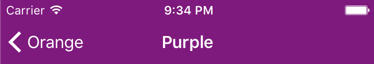
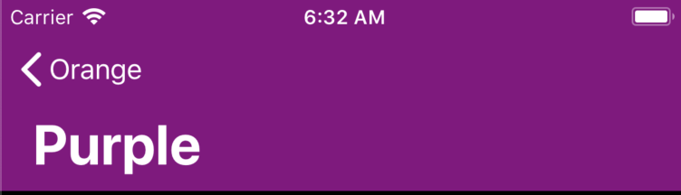

# UINavigationBarDecorator


[](https://travis-ci.org/pisces/UINavigationBarDecorator)
[](http://cocoapods.org/pods/UINavigationBarDecorator)
[](http://cocoapods.org/pods/UINavigationBarDecorator)
[](http://cocoapods.org/pods/UINavigationBarDecorator)
[](https://github.com/Carthage/Carthage)

Compatible UINavigationBarAppearance for all iOS versions

## Features
- Provide AdvancedNavigationBar is able to change size
- Easy to apply navigation bar style for all iOS versions
- Apply navigation bar style as one interface for all iOS versions
- Provide compatible UINavigationBarAppearance for versions below iOS 13
- Provide CompatibleNavigationBarAppearance like UINavigationBarAppearance that is available on iOS 13 higher
- Automatically apply appearance to navigation bar through the view controller life cycle

## Demo


### Normal title on iOS 10.x
<p valign="top">


</p>

### Large title on iOS 11.x
<p valign="top">


</p>

### Large title on iOS 13 higher
<p valign="top">


</p>

## Custom NavigationBar

### AdvancedNavigationBar with Interface Builder
<p valign="top">


</p>

### PageSheetNavigationBar with Interface Builder
<p valign="top">


</p>

### Using Programacally
```swift
let navigationController = UINavigationController(
    rootViewController: #{YourVC}, 
    navigationBarClass: PageSheetNavigationBar.self)
```

## UINavigationBarDecorator

### Using with factory
```swift
class AppDelegate: UIResponder, UIApplicationDelegate {
    func application(_ application: UIApplication, didFinishLaunchingWithOptions launchOptions: [UIApplication.LaunchOptionsKey: Any]?) -> Bool {
        UINavigationBarDecorator.isAllowsSwizzleLifeCycleOfViewController = true
        UINavigationBarDecorator.factory = SampleNavigationBarDecoratorFactory()
        return true
    }
}
```

```swift
struct SampleNavigationBarDecoratorFactory: UINavigationBarDecoratorFactory {
    func create(of vc: UIViewController) -> UINavigationBarDecorator? {
        switch vc {
        case is RootViewController:
            return .init(standard: .orange, compact: .orange, scrollEdge: .orange)
        case is SecondViewController:
            return .init(standard: .purple, compact: .purple, scrollEdge: .purple)
        default:
            return nil
        }
    }
}

extension CompatibleNavigationBarAppearance {
    static var purple: CompatibleNavigationBarAppearance {
        let appearance = CompatibleNavigationBarAppearance()
        appearance.backgroundColor = .purple
        appearance.tintColor = .white
        appearance.largeTitleTextAttributes = [
            .foregroundColor: UIColor.white
        ]
        appearance.titleTextAttributes = [
            .foregroundColor: UIColor.white,
            .font : UIFont.systemFont(ofSize: 17, weight: .semibold)
        ]
        return appearance
    }
    static var orange: CompatibleNavigationBarAppearance {
        let appearance = CompatibleNavigationBarAppearance()
        appearance.backgroundColor = .orange
        appearance.tintColor = .black
        appearance.largeTitleTextAttributes = [
            .foregroundColor: UIColor.black
        ]
        appearance.titleTextAttributes = [
            .foregroundColor: UIColor.black,
            .font : UIFont.systemFont(ofSize: 17, weight: .semibold)
        ]
        return appearance
    }
}
```

### Using without factory
- set the decorator directly on the view controller
```swift
final class ViewController: UIViewController {
    override func viewDidLoad() {
        super.viewDidLoad()
        navigationBarDecorator = .init(standard: .orange, compact: .orange, scrollEdge: .orange)
    }
}
```

### Apply decorator manually
```swift
class AppDelegate: UIResponder, UIApplicationDelegate {
    func application(_ application: UIApplication, didFinishLaunchingWithOptions launchOptions: [UIApplication.LaunchOptionsKey: Any]?) -> Bool {
        UINavigationBarDecorator.isAllowsSwizzleLifeCycleOfViewController = false
        UINavigationBarDecorator.factory = SampleNavigationBarDecoratorFactory()
        return true
    }
}

final class SampleNavigationController: UINavigationController {
    override var childForStatusBarStyle: UIViewController? {
        topViewController
    }
    
    override func viewDidLoad() {
        super.viewDidLoad()
        delegate = self
    }
}

extension SampleNavigationController: UINavigationControllerDelegate {
    func navigationController(_ navigationController: UINavigationController, willShow viewController: UIViewController, animated: Bool) {
        viewController.navigationBarDecorator?.decorate(to: viewController)
    }
    func navigationController(_ navigationController: UINavigationController, didShow viewController: UIViewController, animated: Bool) {
        viewController.navigationBarDecorator?.decorate(to: viewController, by: viewController.view.frame.size)
    }
}
```

## Example

To run the example project, clone the repo, and run `pod install` from the Example directory first.

## Requirements

iOS SDK 10.0 equal or higher

## Installation

UINavigationBarDecorator is available through [CocoaPods](http://cocoapods.org). To install
it, simply add the following line to your Podfile:

```ruby
pod "UINavigationBarDecorator"
```

### Carthage

[Carthage](https://github.com/Carthage/Carthage) is a decentralized dependency manager that builds your dependencies and provides you with binary frameworks.

You can install Carthage with [Homebrew](http://brew.sh/) using the following command:

```bash
$ brew update
$ brew install carthage
```

To integrate Alamofire into your Xcode project using Carthage, specify it in your `Cartfile`:

```ogdl
github "pisces/UINavigationBarDecorator" ~> 1.0.5
```

Run `carthage update` to build the framework and drag the built `UINavigationBarDecorator.framework` into your Xcode project.

## Author

Steve Kim, hh963103@gmail.com

## License

UINavigationBarDecorator is available under the BSD license. See the LICENSE file for more info.
